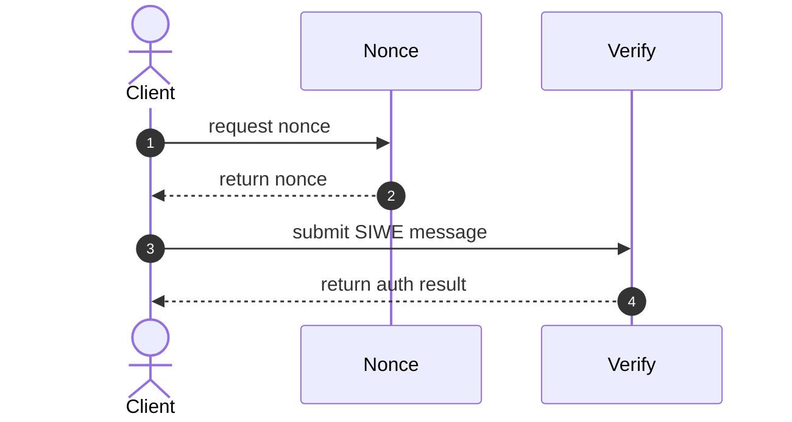

serverless-siwe - Sign in with Ethereum 🤝 Serverless Framework

# Intro

A simple example demonstrating how to use Sign in with Ethereum in conjunction with the Serverless Framework, built using [login.xyz](https://login.xyz/) and [WAGMI's example implementation](https://wagmi.sh/examples/sign-in-with-ethereum).



Two Lambda functions are declared in `packages/api/src/functions`. The `nonce` function returns a randomly-generated [ULID](https://github.com/ulid/javascript) which is incorporated into the SIWE message. The `verify` function validates the SIWE message. 

The stateless nature of this implementation leaves it vulnerable to replay attacks, as the same nonce could be used to authenticate twice. To mitigate this each nonce has an expiry time after which it can no longer be used, shortening the window during which this attack could succeed. An improved implementation could use persistent storage to track used nonces and prevent them being used twice.

Upon receipt of a correctly signed message the `verify` function simply returns true. This could be updated to return centrally-stored user information, provide an authentication token, and so on.

# Usage

To run the application locally you will need to [install `serverless`](https://www.serverless.com/framework/docs/getting-started) and the dependencies for the `api` and `frontend` packages.

Run the following commands in separate terminals:
``` bash
cd packages/api && yarn install && sls offline 
cd packages/frontend && yarn install && yarn start 
```

Open [localhost:3000](http://localhost:3000/), connect your wallet, and sign the login message. You should see a nice green success message confirming everything worked correctly. Note that if you leave the signing confirmation open for >10 seconds the nonce will expire and the verification will fail.

The `sls offline` command uses the [Serverless Offline](https://www.serverless.com/plugins/serverless-offline) plugin to execute the Lambda functions without deploying them to AWS.

The Lambda functions can be deployed with `sls deploy`. This will print out the URL of the API endpoint:

``` 
Running "serverless" from node_modules

Deploying serverless-siwe to stage dev (eu-west-1)

✔ Service deployed to stack serverless-siwe-dev (113s)

endpoints:
  GET - https://xxx.execute-api.eu-west-1.amazonaws.com/api/nonce
  POST - https://xxx.execute-api.eu-west-1.amazonaws.com/api/verify
functions:
  nonce: serverless-siwe-dev-nonce (18 kB)
  verify: serverless-siwe-dev-verify (828 kB)
```

Open `packages/frontend/.env`, replace the `REACT_APP_API_URL` value with the API endpoint's URL prefix (in the above example that would be `https://xxx.execute-api.eu-west-1.amazonaws.com`), and restart the frontend app.

Everything should still work as before, but the verification is now performed by the Lambda functions running in AWS. This can be verified by running `sls logs --function verify --tail` and viewing the Lambda invocation logs.

When finished the AWS resources can be removed with `sls destroy`.
